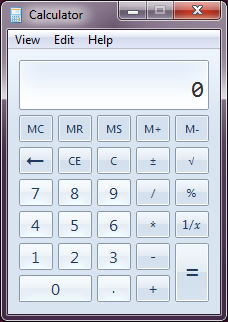
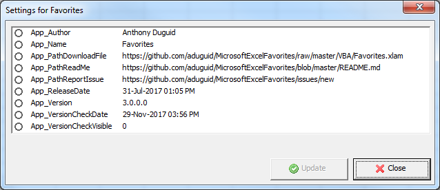
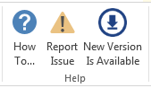
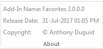

# Microsoft Excel Favorites <span class="Application_Version">3.0.0.0</span> 

[](https://gitter.im/MicrosoftExcelFavorites/Lobby?utm_source=badge&utm_medium=badge&utm_campaign=pr-badge&utm_content=badge)
[](LICENSE "MIT License Copyright © 2017 Anthony Duguid")
[](https://github.com/aduguid/MicrosoftExcelFavorites/releases/latest)


This is an Excel Add-In written in Visual Studio Community 2017 C#/VB.NET and VBA. :new: I'm currently working on the Web Add-In in JavaScript. It gives the user a custom ribbon. Key distinctive attributes include dedicated buttons for [copying visible cells](https://support.office.com/en-us/article/Copy-visible-cells-only-6e3a1f01-2884-4332-b262-8b814412847e), [Excel's camera feature](https://answers.microsoft.com/en-us/msoffice/forum/msoffice_excel-mso_winother/how-to-use-camera-function-in-microsoft-excel/44a97349-f694-4bd3-a5ca-e4097f6e9437?auth=1), [Snipping Tool](https://support.microsoft.com/en-au/help/4027213/windows-open-snipping-tool-and-take-a-screenshot), [Problem Steps Recorder (PSR)](https://support.microsoft.com/en-au/help/22878/windows-10-record-steps) and [Windows Calculator](https://en.wikipedia.org/wiki/Windows_Calculator).
<!---
[](LICENSE "MIT License Copyright © 2017 Anthony Duguid")
[](http://github.com/aduguid/MicrosoftExcelFavorites)
[](http://github.com/aduguid/MicrosoftExcelFavorites/fork)
--->
<h1 align="left">
  
</h1>

<br>

## Table of Contents
- <a href="#install">Install</a>
- <a href="#dependencies">Dependencies</a>
- <a href="#glossary-of-terms">Glossary of Terms</a>
- <a href="#functionality">Functionality</a>
    - <a href="#worksheet">Worksheet</a>
    - <a href="#edit">Edit</a>
    - <a href="#print-group">Print</a>   
    - <a href="#program-group">Program</a>  
    - <a href="#evaluate-group">Evaluate</a>  
    - <a href="#annotation-group">Annotate</a>  
    - <a href="#options-group">Options</a>  
    - <a href="#help">Help</a>
    - <a href="#about">About</a>

<!---
         - <a href="#save">Save</a> 
         - <a href="#save-as">Save As</a> 
    - <a href="#edit">Edit</a>
         - <a href="#undo">Undo</a> 
         - <a href="#copy">Copy</a> 
         - <a href="#cut">Cut</a> 
         - <a href="#paste">Paste</a> 
         - <a href="#spelling">Spelling</a> 
    - <a href="#print-group">Print</a>   
         - <a href="#setup">Setup</a> 
         - <a href="#preview">Preview</a> 
         - <a href="#print">Print</a> 
    - <a href="#program-group">Program</a>  
         - <a href="#new">New</a> 
         - <a href="#open">Open</a> 
         - <a href="#close">Close</a> 
         - <a href="#properties">Properties</a> 
         - <a href="#options">Options</a> 
         - <a href="#exit">Exit</a> 
    - <a href="#evaluate-group">Evaluate</a>  
         - <a href="#calculator">Windows Calculator</a> 
         - <a href="#calculate-now">Calculate Now</a> 
    - <a href="#annotation-group">Annotate</a>  
         - <a href="#camera">Excel Camera</a> 
         - <a href="#snip">Snipping Tool</a> 
         - <a href="#psr">Problem Step Recorder</a> 
    - <a href="#options-group">Options</a>  
         - <a href="#settings">Add-In Settings</a> 
    - <a href="#help">Help</a>
        - <a href="#how-to">How To...</a>  
        - <a href="#report-issue">Report Issue</a>  
    - <a href="#about">About</a>
        - <a href="#description">Add-in Name</a>
        - <a href="#install-date">Release Date</a>  
        - <a href="#copyright">Copyright</a>  
--->

<br>

<a id="user-content-install" class="anchor" href="#install" aria-hidden="true"> </a>
## Install
Instructions for installation of VBA and VSTO versions.

### VBA
How to install the VBA version
1. Download the VBA Add-In file [](https://github.com/aduguid/MicrosoftExcelFavorites/raw/master/VBA/Favorites.xlam?raw=true "Download the VBA Add-In").
2. Copy the file to the XLSTART folder on your computer.  ```%AppData%\Microsoft\Excel\XLSTART\``` 
3. Close all open instances of Excel and then launch Excel. The new ribbon should appear.

### VSTO
How to install the VSTO version
1. Download AnthonyDuguid.pfx And Install At Root Level [](https://github.com/aduguid/MicrosoftExcelFavorites/VB/blob/master/AnthonyDuguid.pfx?raw=true "Download AnthonyDuguid.pfx And Install At Root Level For VSTO")
2. Download and run the setup.exe file. 
[](https://github.com/aduguid/MicrosoftExcelFavorites/blob/master/CS/publish/setup.exe?raw=true "Download Setup.exe Install File")

<br>

<a id="user-content-dependencies" class="anchor" href="#dependencies" aria-hidden="true"> </a>
## Dependencies
|Software                                   |Dependency                 |Project                    |
|:------------------------------------------|:--------------------------|:--------------------------|
|[Microsoft Visual Studio Community 2017](https://www.visualstudio.com/vs/whatsnew/)|Solution|VSTO|
|[Microsoft Office Developer Tools](https://blogs.msdn.microsoft.com/visualstudio/2015/11/23/latest-microsoft-office-developer-tools-for-visual-studio-2015/)|Solution|VSTO|
|[Microsoft Excel 2010 (or later)](https://www.microsoft.com/en-au/software-download/office)|Project|VBA, VSTO|
|[Visual Basic for Applications](https://msdn.microsoft.com/en-us/vba/vba-language-reference)|Code|VBA|
|[Extensible Markup Language (XML)](https://www.rondebruin.nl/win/s2/win001.htm)|Ribbon|VBA, VSTO|
|[Snagit](http://discover.techsmith.com/snagit-non-brand-desktop/?gclid=CNzQiOTO09UCFVoFKgod9EIB3g)|Read Me|VBA, VSTO|
|Badges ([Library](https://shields.io/), [Custom](https://rozaxe.github.io/factory/), [Star/Fork](http://githubbadges.com))|Read Me|VBA, VSTO|

<br>

<a id="user-content-glossary-of-terms" class="anchor" href="#glossary-of-terms" aria-hidden="true"> </a>
## Glossary of Terms

| Term                      | Meaning                                                                                  |
|:--------------------------|:-----------------------------------------------------------------------------------------|
| COM |Component Object Model (COM) is a binary-interface standard for software components introduced by Microsoft in 1993. It is used to enable inter-process communication and dynamic object creation in a large range of programming languages. COM is the basis for several other Microsoft technologies and frameworks, including OLE, OLE Automation, ActiveX, COM+, DCOM, the Windows shell, DirectX, UMDF and Windows Runtime.  |
| VBA |Visual Basic for Applications (VBA) is an implementation of Microsoft's event-driven programming language Visual Basic 6 and uses the Visual Basic Runtime Library. However, VBA code normally can only run within a host application, rather than as a standalone program. VBA can, however, control one application from another using OLE Automation. VBA can use, but not create, ActiveX/COM DLLs, and later versions add support for class modules.|
| VSTO |Visual Studio Tools for Office (VSTO) is a set of development tools available in the form of a Visual Studio add-in (project templates) and a runtime that allows Microsoft Office 2003 and later versions of Office applications to host the .NET Framework Common Language Runtime (CLR) to expose their functionality via .NET.|
| XML|Extensible Markup Language (XML) is a markup language that defines a set of rules for encoding documents in a format that is both human-readable and machine-readable.The design goals of XML emphasize simplicity, generality, and usability across the Internet. It is a textual data format with strong support via Unicode for different human languages. Although the design of XML focuses on documents, the language is widely used for the representation of arbitrary data structures such as those used in web services.|

<br>

<a id="user-content-functionality" class="anchor" href="#functionality" aria-hidden="true"> </a>
## Functionality
This Excel ribbon named “Favorites” is inserted after the “Home” tab when Excel opens.

<a id="user-content-worksheet" class="anchor" href="#worksheet" aria-hidden="true"> </a>
### Worksheet (Group)
<a id="user-content-save" class="anchor" href="#save" aria-hidden="true"> </a>
#### Save (Button)
* Save (Ctrl + S)

<a id="user-content-save-as" class="anchor" href="#save-as" aria-hidden="true"> </a>
#### Save As (Button)
* Save As (F12)

<a id="user-content-edit" class="anchor" href="#edit" aria-hidden="true"> </a>
### Edit (Group)
<a id="user-content-undo" class="anchor" href="#undo" aria-hidden="true"> </a>
#### Undo (Button)
* Undo (Ctrl + Z)

<a id="user-content-copy" class="anchor" href="#copy" aria-hidden="true"> </a>
#### Copy (Button)
* Copy (Ctrl + C)

<a id="user-content-cut" class="anchor" href="#cut" aria-hidden="true"> </a>
#### Cut (Button)
* Cut (Ctrl + X)

<a id="user-content-paste" class="anchor" href="#paste" aria-hidden="true"> </a>
#### Paste (Button)
* Paste (Ctrl + V)

<a id="user-content-spelling" class="anchor" href="#spelling" aria-hidden="true"> </a>
#### Spelling (Button)
* Spelling (F7)

<a id="user-content-print-group" class="anchor" href="#print-group" aria-hidden="true"> </a>
### Print (Group)
<a id="user-content-setup" class="anchor" href="#setup" aria-hidden="true"> </a>
#### Setup (Button)
* Show the Sheet tab of the page setup dialog box

<a id="user-content-preview" class="anchor" href="#preview" aria-hidden="true"> </a>
#### Preview (Button)
* Preview (Ctrl + F2)

<a id="user-content-print" class="anchor" href="#print" aria-hidden="true"> </a>
#### Print (Button)
* Print (Ctrl + P)

<a id="user-content-program" class="anchor" href="#program" aria-hidden="true"> </a>
### Program (Group)
<a id="user-content-new" class="anchor" href="#new" aria-hidden="true"> </a>
#### New (Button)
* New file

<a id="user-content-open" class="anchor" href="#open" aria-hidden="true"> </a>
#### Open (Button)
* Open (Ctrl + O)

<a id="user-content-close" class="anchor" href="#close" aria-hidden="true"> </a>
#### Close (Button)
* Close file

<a id="user-content-properties" class="anchor" href="#properties" aria-hidden="true"> </a>
#### Properties (Button)
* Open the properties of the file

<a id="user-content-options" class="anchor" href="#options" aria-hidden="true"> </a>
#### Options (Button)
* Open the options dialog box

<a id="user-content-exit" class="anchor" href="#exit" aria-hidden="true"> </a>
#### Exit (Button)
* Exit the application

<a id="user-content-evaluate-group" class="anchor" href="#evaluate-group" aria-hidden="true"> </a>
###	Evaluate (Group)

<a id="user-content-calculator" class="anchor" href="#calculator" aria-hidden="true"> </a>
#### Windows Calculator (Button)



  - The Windows Calculator runs in standard mode, which resembles a four-function calculator. More advanced functions are available in scientific mode, including logarithms, numerical base conversions, some logical operators, operator precedence, radian, degree and gradians support as well as simple single-variable statistical functions

<a id="user-content-calculate-now" class="anchor" href="#calculate-now" aria-hidden="true"> </a>
#### Calculate Now (Button)

  - Force the Calculation. Even if the Calculation option is set for Manual, you can force a calculation. 
  
<a id="user-content-annotation-group" class="anchor" href="#annotation-group" aria-hidden="true"> </a>
###	Annotate (Group)

<a id="user-content-camera" class="anchor" href="#camera" aria-hidden="true"> </a>
#### Excel Camera(Button)

  - The camera tool allows you to take a snapshot of any selected range of data, table, or graph, and paste it as a linked picture.
The pasted snapshot can be formatted and resized using picture tools. They can be copied and pasted into Word and PowerPoint documents as well. The image is automatically refreshed if the data changes.

<a id="user-content-snip" class="anchor" href="#snip" aria-hidden="true"> </a>
#### Snipping Tool (Button)


  - Capture all or part of your PC screen, add notes, save the snip, or email it from the Snipping Tool window. You can capture any of the following types of snips:
    - Free-form snip. Draw a free-form shape around an object.
    - Rectangular snip. Drag the cursor around an object to form a rectangle.
    - Window snip. Select a window, such as a browser window or dialog box, that you want to capture.
    - Full-screen snip. Capture the entire screen.

<a id="user-content-psr" class="anchor" href="#psr" aria-hidden="true"> </a>
#### Problem Step Recorder (Button)


  - Steps Recorder (called Problems Steps Recorder in Windows 7), is a program that helps you troubleshoot a problem on your device by recording the exact steps you took when the problem occurred. You can then send this record to a support professional to help them diagnose the problem.

<a id="user-content-options" class="anchor" href="#options" aria-hidden="true"> </a>
###	Options (Group)

#### Add-In Settings (Button)

<kbd>
VSTO
<br>
  
</kbd>

- Types of VSTO Settings
  - Application Settings
    - These settings can only be changed in the project and need to be redeployed
    - They will appear disabled in the form
  - User Settings
    - These settings can be changed by the end-user
    - They will appear enabled in the form
    
<kbd>
VBA
<br>
  
</kbd>

- VBA Settings
  - To add a new setting
    ```vbnet
    ThisWorkbook.CustomDocumentProperties.Add _
    Name:="App_ReleaseDate" _
    , LinkToContent:=False _
    , Type:=msoPropertyTypeDate _
    , Value:="31-Jul-2017 1:05pm"
    ```
  - To update a setting
    ```vbnet
    ThisWorkbook.CustomDocumentProperties.Item("App_ReleaseDate").Value = "31-Jul-2017 1:05pm"
    ```
  - To delete a setting
    ```vbnet
    ThisWorkbook.CustomDocumentProperties.Item("App_ReleaseDate").Delete
    ```
<a id="user-content-help" class="anchor" href="#help" aria-hidden="true"> </a>
###	Help (Group)
<h1 align="left">
  
</h1>

<a id="user-content-how-to" class="anchor" href="#how-to" aria-hidden="true"> </a>
####	How To... (Button)
* Opens the how to guide in a browser

<a id="user-content-report-issue" class="anchor" href="#report-issue" aria-hidden="true"> </a>
####	Report Issue (Button)
* Opens the new issue page in a browser

<a id="user-content-new-version" class="anchor" href="#new-version" aria-hidden="true"> </a>
####	New Version Is Available (Button)
* This button is visible if the version of the Add-In is different from the one in the Read Me page. It will download a new version from the site when pressed.

<a id="user-content-about" class="anchor" href="#about" aria-hidden="true"> </a>
###	About (Group)

<h1 align="left">
  
</h1>

<a id="user-content-description" class="anchor" href="#description" aria-hidden="true"> </a>
#### Add-in Name (Label)
* The application name with the version

<a id="user-content-release-date" class="anchor" href="#release-date" aria-hidden="true"> </a>
#### Release Date (Label)
* The release date of the application

<a id="user-content-copyright" class="anchor" href="#copyright" aria-hidden="true"> </a>
#### Copyright (Label)
* The author’s name
