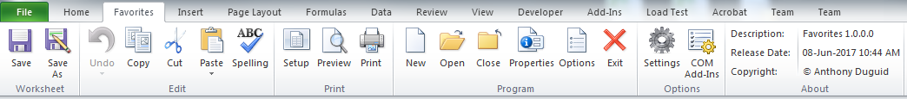

# MicrosoftExcelFavoritesRibbon
This is an Excel 2010 VSTO Addin written in Visual Studio Community 2017 VB.Net. It gives the user a custom favorites ribbon.

<h1 align="center">
  
</h1>

## Dependencies
|Software                                   |Dependency                 |
|:------------------------------------------|:--------------------------|
|[Microsoft Visual Studio Community 2017](https://www.visualstudio.com/vs/whatsnew/)|Solution|
|[Microsoft Excel 2010](https://www.microsoft.com/en-au/software-download/office)|Project|

## Functionality
This Excel ribbon named “Favorites” is inserted after the “Home” tab when Excel opens.
